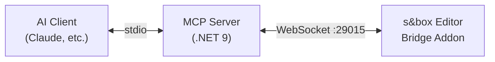

<p align="center">
  
</p>

# sbox-mcp — MCP Server for s&box

[](https://github.com/StephenSHorton/sbox-mcp/actions/workflows/build.yml)
[](https://github.com/StephenSHorton/sbox-mcp/releases/latest)
[](LICENSE)
[](https://sbox.game)

AI-powered editor automation for the s&box game engine via the Model Context Protocol.

---

## Architecture



The MCP Server exposes tools over **stdio** (consumed by AI clients like Claude Desktop or Claude Code). It forwards commands over a **WebSocket** connection to the Bridge Addon running inside the s&box editor, which executes them against the live scene and returns results.

### Hotload resilience

The bridge subscribes to the editor's `hotloaded` event and tears down + reconnects after every hotload. Bridge command dispatch uses a switch expression (not a static delegate dictionary) so the routing table can't get stranded across assembly versions. Each dispatch is time-bounded by the `sbox_mcp_main_thread_timeout_ms` ConVar (default 15s) — if the editor's main thread is wedged, commands fail with a structured error rather than hanging. `get_bridge_status` probes `bridge.health` (which bypasses the main thread) to report whether the bridge is actually responsive, not just connected.

---

## Features

- **Scene manipulation** — create, clone, reparent, transform, and delete GameObjects
- **Component editing** — add, inspect, and modify component properties including s&box resource types (Model, Material, Color, Vector3)
- **Cloud assets** — search, fetch, and mount assets from the s&box cloud store; auto-adds to project PackageReferences
- **Tag management** — add, remove, and list tags on GameObjects
- **File operations** — read and write project files; `.cs` files go to the `code/` directory automatically
- **Play mode** — start/stop play mode and check status
- **Editor control** — selection, undo/redo, save, scene info
- **Code execution** — run C# expressions and console commands in the editor context
- **Component authoring** — write new C# components via MCP and attach them to GameObjects

---

## Prerequisites

- [s&box editor](https://sbox.game) (for the Bridge Addon)
- [.NET 9 SDK](https://dotnet.microsoft.com/download/dotnet/9.0) — **only if building from source.** The prebuilt release is self-contained.

---

## Setup

### Quick Install (Recommended)

1. Download the latest `sbox-mcp-<version>-win-x64.zip` from the [Releases page](https://github.com/StephenSHorton/sbox-mcp/releases/latest).
2. Extract it anywhere you like — just pick a stable location you won't move. The zip contains:
   - `SboxMcp.Server.exe` — the self-contained MCP server (no .NET runtime required).
   - `bridge/` — the editor addon source files.
3. Register the MCP server with your client (replace `<install-dir>` with wherever you extracted the zip):

   **Claude Code:**
   ```bash
   claude mcp add -s user sbox -- "<install-dir>\SboxMcp.Server.exe"
   ```

   **Claude Desktop / Other MCP Clients:**
   ```json
   {
     "mcpServers": {
       "sbox": {
         "command": "<install-dir>\\SboxMcp.Server.exe"
       }
     }
   }
   ```

4. Copy the bridge addon into your s&box install:
   ```bash
   cp -r bridge/* "<sbox-install>/addons/tools/Code/McpBridge/"
   ```

The addon starts automatically when the s&box editor opens. A dockable **MCP Bridge** panel shows connection status, command count, and activity log.

### Build from Source

If you want to build from source instead, you'll need the [.NET 9 SDK](https://dotnet.microsoft.com/download/dotnet/9.0):

```bash
git clone https://github.com/StephenSHorton/sbox-mcp.git
cd sbox-mcp
dotnet build sbox-mcp.sln --configuration Release
```

Then register the server with `dotnet run`:

```bash
claude mcp add -s user sbox -- dotnet run --project /path/to/src/SboxMcp.Server -c Release
```

And copy the bridge into your s&box install:

```bash
cp -r src/SboxMcp.Bridge/code/* "<sbox-install>/addons/tools/Code/McpBridge/"
```

---

## Available Tools

### Scene (10 tools)

| Tool | Description |
|------|-------------|
| `scene_list_objects` | List all GameObjects in the scene |
| `scene_get_object` | Get detailed GameObject info with components |
| `scene_create_object` | Create a new GameObject |
| `scene_delete_object` | Delete a GameObject |
| `scene_find_objects` | Search GameObjects by name (supports `*` wildcards) |
| `scene_set_transform` | Set position/rotation/scale |
| `scene_get_hierarchy` | Get full scene tree as indented text |
| `scene_clone_object` | Duplicate a GameObject |
| `scene_reparent_object` | Move a GameObject to a different parent |
| `scene_load` | Open a scene file in the editor |

### Scene Search (2 tools)

| Tool | Description |
|------|-------------|
| `scene_find_by_component` | Find all objects with a specific component type |
| `scene_find_by_tag` | Find all objects with a specific tag |

### Components (5 tools)

| Tool | Description |
|------|-------------|
| `component_list` | List components on a GameObject |
| `component_get` | Get component properties and values |
| `component_set` | Set a component property (handles Model, Material, Color, Vector3, Angles) |
| `component_add` | Add a component by type name |
| `component_remove` | Remove a component |

### Tags (3 tools)

| Tool | Description |
|------|-------------|
| `tag_add` | Add a tag to a GameObject |
| `tag_remove` | Remove a tag from a GameObject |
| `tag_list` | List all tags on a GameObject |

### Cloud Assets (4 tools)

| Tool | Description |
|------|-------------|
| `asset_search` | Search the s&box cloud asset store |
| `asset_fetch` | Get metadata for a specific cloud package |
| `asset_mount` | Mount a cloud package (auto-adds to project PackageReferences) |
| `asset_browse_local` | Browse local project assets |

### Editor (8 tools)

| Tool | Description |
|------|-------------|
| `editor_get_selection` | Get currently selected GameObjects |
| `editor_select_object` | Select a GameObject by ID |
| `editor_undo` | Undo last action |
| `editor_redo` | Redo last action |
| `editor_save_scene` | Save the current scene |
| `editor_play` | Start play mode |
| `editor_stop` | Stop play mode |
| `editor_is_playing` | Check if editor is in play mode |
| `editor_scene_info` | Get scene name, path, and dirty state |
| `editor_console_output` | Get recent console log entries |

### Files & Execution (5 tools)

| Tool | Description |
|------|-------------|
| `file_read` | Read a project file |
| `file_write` | Write a project file (`.cs` files auto-target `code/` directory) |
| `file_list` | List project files with glob patterns |
| `project_info` | Get project metadata |
| `execute_csharp` | Execute C# in the editor context |
| `console_run` | Run a console command |
| `get_bridge_status` | Check bridge connection status |

---

## Cloud Asset Workflow

The MCP server can search, mount, and use cloud assets from the s&box asset store:

```
1. asset_search "barrel"           → find available assets
2. asset_mount "polyhaven.barrel_03" → download and mount
3. component_set Model → "polyhaven.barrel_03"  → auto-fetches, mounts, and loads
```

When a cloud asset is mounted or set on a component, it's automatically added to the project's `PackageReferences` in `.sbproj` so it persists across editor restarts.

---

## Configuration

| Variable | Default | Description |
|----------|---------|-------------|
| `SBOX_MCP_PORT` | `29015` | WebSocket port for the bridge connection |

---

## Development

### Build

```bash
dotnet build sbox-mcp.sln
```

### Run

```bash
dotnet run --project src/SboxMcp.Server
```

### Deploy Bridge Changes

```bash
cp -r src/SboxMcp.Bridge/code/* "<sbox-install>/addons/tools/Code/McpBridge/"
```

s&box hot-reloads C# changes. Restart only needed if compilation fails.

### Project Structure

```
sbox-mcp/
├── src/
│   ├── SboxMcp.Server/          # .NET 9 MCP server (stdio transport)
│   │   ├── Tools/               # MCP tool definitions
│   │   └── Bridge/              # WebSocket server + message types
│   └── SboxMcp.Bridge/          # s&box Roslyn addon
│       └── code/
│           ├── Handlers/        # Command handlers (Scene, Component, Asset, Editor, File)
│           ├── CommandRouter.cs # Routes commands to handlers
│           └── McpEditorTool.cs # Editor dock widget
├── .github/workflows/
├── sbox-mcp.sln
└── README.md
```

---

## How It Works

1. An AI client launches the MCP Server as a subprocess and communicates over **stdio** using the Model Context Protocol.
2. When the AI calls a tool, the MCP Server serializes the request and sends it over a **WebSocket** to the Bridge Addon running inside the s&box editor.
3. The Bridge Addon executes the request against the live scene (reading/writing GameObjects, components, assets, files, etc.) and returns a JSON response.
4. The MCP Server forwards the response back to the AI client over stdio.

The server auto-kills stale instances on port conflict, so multiple sessions won't deadlock.

---

## Contributing

Pull requests are welcome. For significant changes, please open an issue first to discuss what you would like to change.

This project is licensed under the [MIT License](LICENSE).

---

## Acknowledgments

- [Facepunch Studios](https://facepunch.com) for the s&box game engine and editor
- [Anthropic](https://anthropic.com) for the [Model Context Protocol](https://modelcontextprotocol.io) specification
